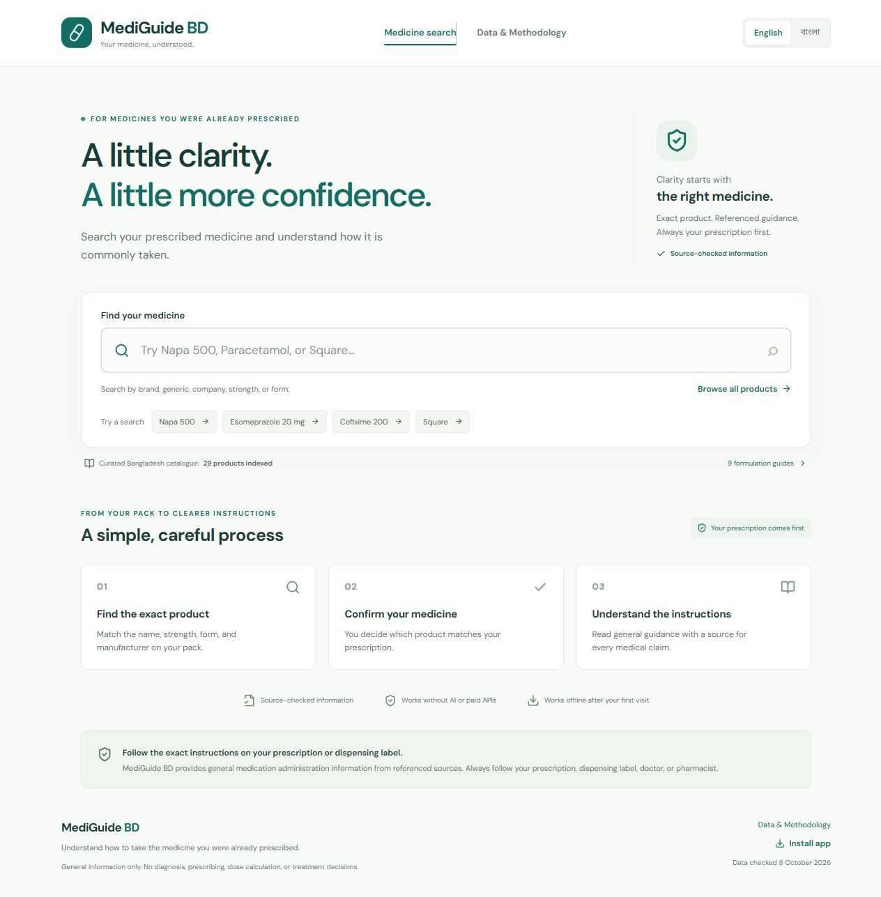
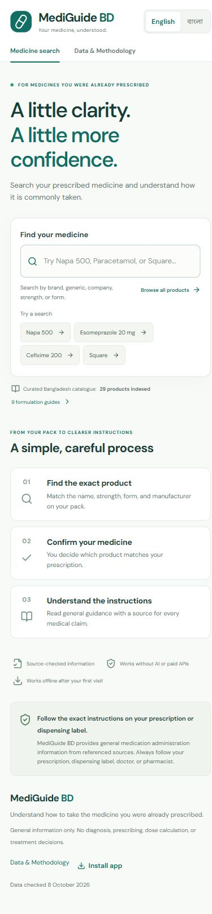
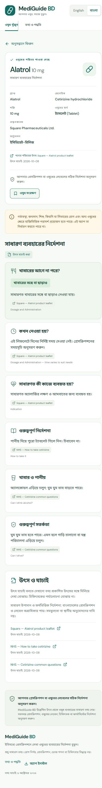
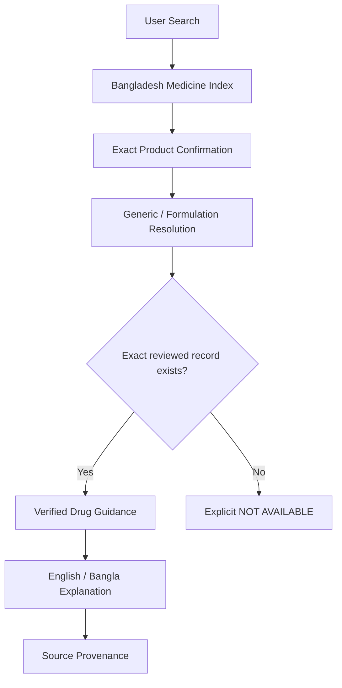

# MediGuide BD

**Understand how to take the medicine you were already prescribed.**

An evidence-grounded bilingual medication instruction system for Bangladesh that resolves local medicine brands to their generic formulations and provides source-backed food, timing, administration and common-use information, with explicit abstention when evidence is unavailable.

**[Live application](https://shihabbk18.github.io/mediguide-bd/)** · **[Data & Methodology](https://shihabbk18.github.io/mediguide-bd/#methodology)**

## The problem and intended users

People reading an existing prescription or dispensing label often recognise a local brand but need clarity about meals, timing or formulation-specific administration. MediGuide BD helps them identify the exact medicine pack before showing general, referenced information in English or Bangla.

It is an instruction explainer, not a diagnosis system, prescribing system, pharmacy, or replacement for a doctor or pharmacist. No patient-specific dose or treatment duration is calculated.

## Screenshots



| Mobile search | Bangla guidance |
| --- | --- |
|  |  |

## Actual coverage

| Measure | Current seed |
| --- | ---: |
| Bangladesh product identities | **29** |
| Generic / dosage form / release-type guidance records | **9** |
| Products with matching guidance | **15** |
| Products that explicitly abstain | **14** |
| Manufacturer publication sets | **2** (Beximco and Square) |
| Linked source publications/pages | **16** |
| Source check date | **8 October 2026** |

This is a curated demonstration catalogue, **not every medicine in Bangladesh**. It includes Napa, Napa Extra, Seclo, Seclo MUPS, Nexum, Comet, Comet XR, Cef-3, Cef-3 DS, Cef-3 Forte, Amdocal and Alatrol identities across real published strengths and formulations. Manufacturer names preserve source wording. Publication presence does not confirm current stock or DGDA registration; registration numbers remain unverified/null.

## Architecture



React + TypeScript + Vite, responsive CSS, Zod, Fuse.js, Vitest, and vite-plugin-pwa/Workbox. The public app is entirely static: no server, authentication, database, inference service or paid API is required. Product and claim data are versioned JSON; CSV/JSON imports are validated separately.

## Search pipeline

1. Unicode/case/whitespace normalisation and strength token separation (`500mg` → `500 mg`).
2. Exact and partial matching across brand, ingredient, company, strength, dosage form and release type.
3. Fuse.js fuzzy candidates plus a bounded one-edit/transposition check for short misspellings.
4. Token intersection supports mixed-field queries such as `Cefixime 200 tablet`; exact ingredient tokens take priority over lookalike ingredients. Numeric tokens are never fuzzy-corrected.
5. Ranked product cards retain every identity; combination products and different formulations are never merged.
6. Selecting a result reveals the complete identity. The user must explicitly confirm it before guidance appears.
7. Medical resolution is a strict `(generic, dosage form, release type)` key lookup, never fuzzy matching.

## Data sources and evidence model

Bangladesh identities come from individually checked manufacturer product leaflets/pages. General claims come from NHS patient guidance, DailyMed labels and Square administration/indication publications. Every medical claim contains English and Bangla text, source IDs and a source section; missing evidence stays missing.

DGDA's public catalogue was investigated first. No documented bulk API or authorised complete dataset was located within the source preflight. Direct robots retrieval failed secure certificate validation, so no automated crawl was attempted. See [the curation log](docs/DATA_SOURCES.md).

DailyMed and openFDA retrieval adapters are implemented in `scripts/source-adapters.ts` and successfully probed. **openFDA output is not used as published MVP guidance.** Neither adapter can auto-publish a label or assign verification; incoming labels need ingredient/formulation/local-label review. The runtime does not depend on external APIs.

`VERIFIED` means source-checked displayed claims, **not independent clinician/pharmacist approval or local product bioequivalence**. `PARTIALLY_VERIFIED` is supported in the schema, but none of the current records use it. Missing matches and `NOT_AVAILABLE` records yield an explicit unavailable message. Some source publications are old; the check date is not a publication date.

## Safety model

- No dose selection, frequency generation, treatment duration, diagnosis, medicine initiation/discontinuation/replacement or overdose management.
- No invented morning, evening or bedtime advice. Unsupported timing says it has not been verified.
- Immediate-release and extended-release metformin are separate records. Unsupported Napa liquid/suppository, Napa Extra, MUPS and other formulations abstain instead of inheriting tablet/capsule advice.
- High-risk context notices direct users to their prescription and a clinician/pharmacist. No advice is personalised for pregnancy, breastfeeding, children, kidney/liver disease or complex medicines.
- Guidance does not claim complete interaction checks, all warnings or suitability for an individual.
- A persistent note prioritises the prescription, dispensing label, doctor and pharmacist.

## English / বাংলা

Visible language toggle; deterministic, manually authored UI and core instructions. Brand, generic and manufacturer names remain unchanged. Form labels are explained in Bangla while preserving the English pack term. There is no machine translation. Independent professional review of medical Bangla is a known outstanding requirement.

## PWA installation and privacy

On Android Chrome, open the browser menu and choose **Install app / Add to Home Screen**. iPhone users can use **Share → Add to Home Screen**. The app includes a manifest, 192/512px icons, standalone/splash metadata and a precached application shell plus local catalogue. A new service-worker version prompts for an update.

After a successful first load/cache, the core app works offline. Source links require internet. Offline records may become outdated; check dates stay visible. Real-device installation remains a separate follow-up from browser viewport testing.

Search stays on the device. Favorites and recently confirmed medicines store only product IDs in localStorage. A clear control removes both. No accounts, analytics, diagnoses or prescription text are collected. Google Fonts is optional for typography; system fonts provide a fallback if offline or blocked.

## Run locally

Node.js **24** and pnpm **11.19.0** (the version used for this build and CI):

```sh
pnpm install --frozen-lockfile
pnpm dev
pnpm validate:data
pnpm test
pnpm build
```

For GitHub Pages:

```sh
# POSIX shell
VITE_BASE_PATH=/mediguide-bd/ pnpm build

# PowerShell
$env:VITE_BASE_PATH='/mediguide-bd/'
pnpm build
```

## Authorised catalogue imports

```sh
pnpm import:products ./authorised-products.csv
pnpm import:products ./authorised-products.json --write
```

Default mode only validates. `--write` replaces the product catalogue atomically after schema/duplicate checks. Invalid imports preserve the existing catalogue. See [example CSV](docs/product-import.example.csv). Source URL, source section, check date and risk flag are required. Registration number may be null. New products do not automatically gain verified guidance.

```sh
# Probe retrieval adapters; does not modify the catalogue or guidance
node --import tsx scripts/source-adapters.ts probe
```

## Testing and deployment

**24 automated tests passed, 0 failed** locally, covering all eleven requested test categories plus mixed-field search, numeric-strength refusal, provenance, translation completeness, confirmation reset and importer rejection. TypeScript and production PWA build passed. Browser acceptance checks covered all six requested medicine categories at desktop and mobile sizes; each was confirmed, checked for food/source display and toggled to Bangla.

The GitHub Actions workflow `.github/workflows/deploy.yml` validates data, runs tests, type-checks/builds and deploys the static artifact to GitHub Pages only after success. Source is pushed to [shihabbk18/mediguide-bd](https://github.com/shihabbk18/mediguide-bd). Detailed acceptance results are in [TEST_REPORT.md](docs/TEST_REPORT.md).

## Limitations and future work

- Curated 29-product coverage, with 14 intentional abstentions; no complete authorised national dataset.
- No independent pharmacist/clinician review or professional Bangla review yet.
- Source publications may be old; no live refresh, source-change monitoring or registration verification.
- Foreign ingredient labels are general evidence, not proof of equivalence for a Bangladesh brand.
- No personalised instructions, comprehensive interaction checks, prescription uploads or dose calculator.
- Optional prescription-notation explainer deliberately omitted from this MVP.
- Next: licensed catalogue expansion, expert review, dated label snapshots/version IDs, periodic rechecks and real Android installation testing.

## Portfolio positioning

> MediGuide BD — an evidence-grounded bilingual medication instruction system for Bangladesh that resolves local medicine brands to their generic formulations and provides source-backed food, timing, administration, and common-use information with explicit abstention when evidence is unavailable.

Demonstrates information retrieval, fuzzy search, data normalisation, provenance, health informatics, bilingual UX, responsible abstention, automated testing and PWA deployment without relying on an LLM as medical truth.
