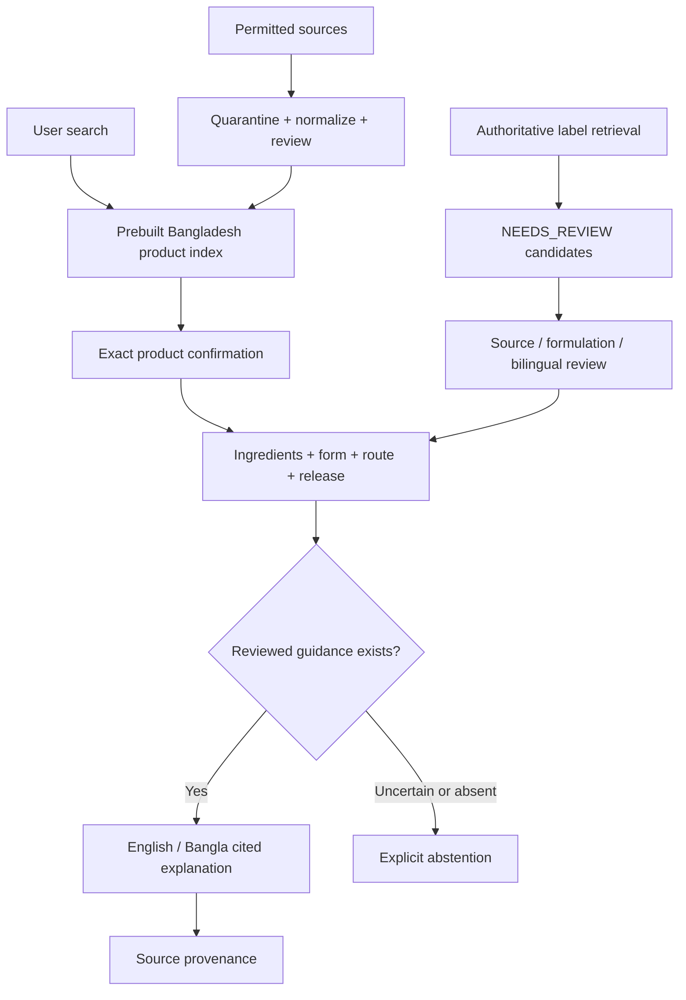

# MediGuide BD

**Understand how to take the medicine you were already prescribed.**

[Live app](https://shihabbk18.github.io/mediguide-bd/) · [Data & Methodology](https://shihabbk18.github.io/mediguide-bd/#methodology) · [Data pipeline](docs/DATA_PIPELINE.md)

An evidence-grounded bilingual medication instruction system for Bangladesh that resolves local brands to ingredient formulations and provides cited administration information, with explicit abstention when evidence is unavailable. It helps people understand an existing prescription; it does not diagnose, prescribe or sell medicines.

## Actual coverage

The 8 October 2026 upgrade expands the original 29-product seed to **177 product records**, **106 distinct brand strings**, **124 ingredient/form/route/release keys**, and **17 guidance records**: **13 VERIFIED**, **4 PARTIALLY_VERIFIED**. At product level, **25 resolve to verified guidance**, **4 to partial guidance**, and **148 abstain**. There are **25 source entries**. Counts are generated from production data; unknown release keys are included in the formulation count.

**This is not full Bangladesh coverage.** Manufacturer publications do not prove current market availability or DGDA registration. Registration numbers remain null. Many oral mappings remain UNKNOWN/NEEDS_REVIEW rather than assumed immediate release.

The official DGHS/MoHFW API was investigated, but no redistribution permission or licensed export was supplied. Its roughly 39,195 source concepts were **not bulk imported**. MedEx and Healthcare Pharmaceuticals reuse restrictions were respected. There is no unauthorized production scraper.

## Screenshots


| Mobile search                                                                | Bangla guidance                                                                           |
| ---------------------------------------------------------------------------- | ----------------------------------------------------------------------------------------- |
|  |  |

These images show the original interface retained by the upgrade; older screenshots may show previous coverage. Current counts are on the live dashboard and in src/data/coverage.json.

## Architecture



React, TypeScript and Vite preserve the existing responsive UI. Zod validates identities, provenance and guidance. A prebuilt token inverted index searches brand, generic, manufacturer, strength and form with partial/prefix matching and one-edit/transposition typo tolerance. Numeric strengths are never fuzzy-corrected. At most 60 results render, with total count and refinement prompt. Above 2,000 products a debounced Web Worker performs queries off the UI thread with stale-response protection.

Identity and guidance datasets are independent. Combination ingredients are sorted into combination keys; salt names are not blindly collapsed. Capsules, MUPS, injections, IR and ER remain distinct. Fuzzy brand matches and first ingredients never determine clinical guidance.

## Sources and safety

Identities: Beximco leaflets and Square manufacturer publications, including the published 9th-edition guide. Guidance: manufacturer publications, NHS and DailyMed. openFDA retrieval creates unpublished review candidates. Each clinical claim has English/Bangla text, source IDs and a source section.

VERIFIED means displayed facts were checked against publications, **not independent pharmacist review, bioequivalence or local approval**. PARTIALLY_VERIFIED exposes limited reviewed fields. Non-oral meal relevance is inferred from the cited route and disclosed as partial; timing remains prescription-dependent. Unknown mapping, release, food and timing never become guesses.

No patient-specific dose, frequency, duration, treatment change, pregnancy/child/kidney/liver treatment or overdose management is generated. A schema guard rejects common dosing/treatment-change text, backed by whole-dataset tests. This is not a complete safety leaflet or interaction checker. Follow the prescription, dispensing label, doctor or pharmacist.

English/Bangla UI and instructions are manually authored deterministic templates. Medicine/company names are preserved. Independent clinical and professional Bangla review remain future work.

## Run and extend

Requires Node 22+ and pnpm. Optional PDF extraction additionally needs Python and pdfplumber; the website has no Python/API runtime dependency.

```sh
pnpm install --frozen-lockfile
pnpm dev
pnpm build:data
pnpm validate:data
pnpm test
pnpm build
pnpm preview
```

For Pages set VITE_BASE_PATH=/mediguide-bd/. The existing GitHub Actions workflow validates, tests, builds and deploys pushes to main.

See [DATA_PIPELINE.md](docs/DATA_PIPELINE.md) for gated DGHS import, normalization, idempotent reviewed manufacturer imports, CSV/JSON validation, openFDA review queues and reviewed-guidance publication. Production consumes prebuilt local data; no paid LLM is required.

## PWA and privacy

On Android Chrome choose **Install app / Add to Home Screen**. The manifest, icons and service worker cache the app shell and catalogue. Source links require internet. Cached data may be stale; use the update banner when offered. Favorites/recent medicines contain only IDs in localStorage. No accounts, diagnoses, analytics or prescription uploads.

## Validation and limitations

The upgrade suite passed **54 tests across 3 files**, covering requested A–O cases, confirmation, provenance, abstention, IR/ER, combinations, bilingual rendering, imports, dose rejection and 40,000 synthetic-record retrieval. Fixtures do not add production coverage. See [test report](docs/TEST_REPORT.md) for final checks.

Remaining work: authorized nationwide data export; review unresolved formulations and combinations; independent pharmacist/Bangla review; periodic source checks; mobile profiling and chunked loading for substantially larger payloads. No complete Bangladesh coverage claim is made.
